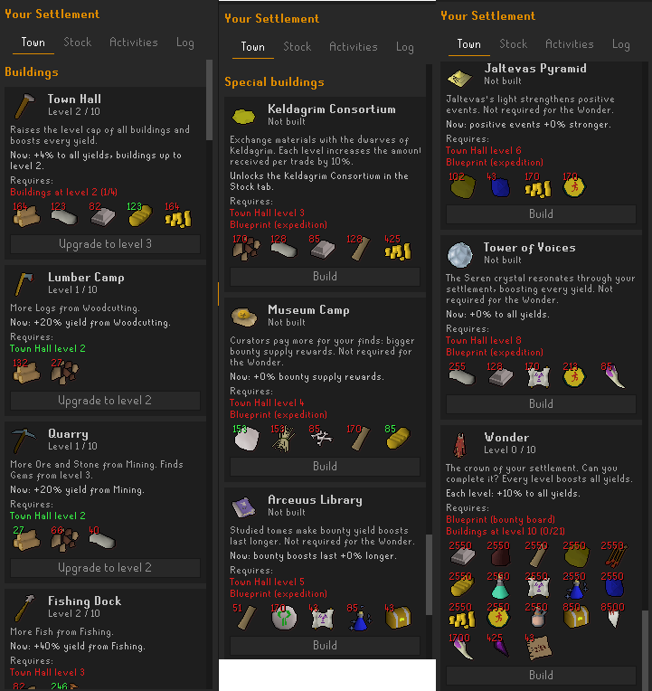
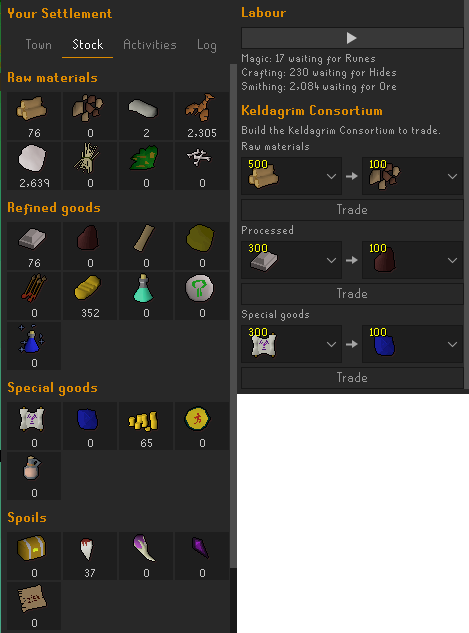
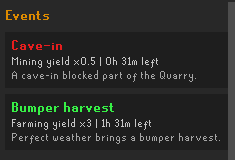
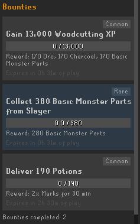
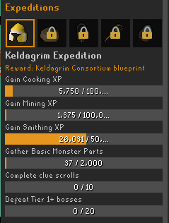
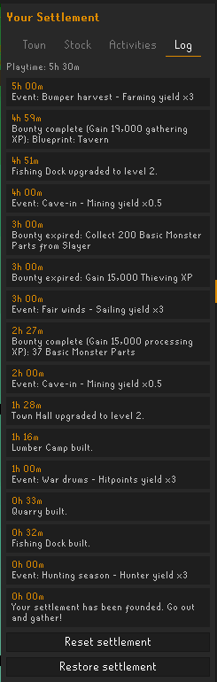

# OSRS Settlement
Ever felt you should do some mining, but can't be asked? Having to do clues for those ranger boots, but well, yeah... Or just want some variety in how you progress in the game. This plugin tries to nudge you into doing various activities in Oldschool Runescape, without making it feel like a grind. Progressing your settlement quickly, means you have to switch up your gameplay to gather all neccesary resources. Long grinds are actually less efficient!

This plugin adds an entire minigame in your Runelite sidebar, where your in-game activity helps a settlement grow. Gather and process resources, develop buildings, take on objectives, and work towards the Wonder.

## Buildings

Buildings connect settlement growth to in-game skills and activities. Gathering and processing buildings improve related production and unlock further progression. Special buildings add distinct systems: the Keldagrim Consortium enables trading, while expedition buildings provide benefits to bounties, boosts, events, and yields. The Wonder is the settlement's capstone building, with further upgrades continuing to benefit production. Are you able to complete it?

## Stock

The Stock tab shows raw, refined, and special resources received by skilling, along with spoils received from monster slaying and clue hunting. Processing work is saved as Labour when inputs run short and resumes as materials become available; queued Labour can also be paused. 

The Keldagrim Consortium, once unlocked by completing the Keldagrim Expedition, lets you exchange resources for other items in the same category.

## Activities

The Activities tab brings together temporary events, bounties, and expedition progress. Progress comes only from activity observed while the plugin is running; past XP and encounters are not credited retroactively.

### Events

Events temporarily affect settlement production. Their effects can combine with building bonuses and active boosts. Event time only advances during logged-in play.

### Bounties

Bounties offer objectives related to skills, combat, or delivering resources. Completing an objective makes its reward available to claim; claiming it opens a slot for another task. Unfinished bounties expire so tasks that do not suit an account cannot block the board indefinitely. Some buildings require a blueprint from a bounty. Don't worry about missing it, all eligble blueprints will be offered again until claimed.

### Expeditions

Expeditions form a static sequence of tasks. Only the current expedition advances. Claiming its completed reward unlocks a special building blueprint and opens the next expedition.

## Log

The Log tab shows settlement playtime and recent milestones and events. It also contains the controls to reset or restore that profile's settlement. Resetting your settlement will use the current state to overwrite the backup state.

## Profiles

Each RuneLite profile has its own settlement. Login to your in-game account and your OSRS Settlement profile will be automatically loaded. 

## Development

- `./gradlew test` runs the unit tests and economy simulation.
- `./gradlew run` starts a development client with the plugin loaded.
- Detailed design notes are in [docs/PLAN.md](docs/PLAN.md).